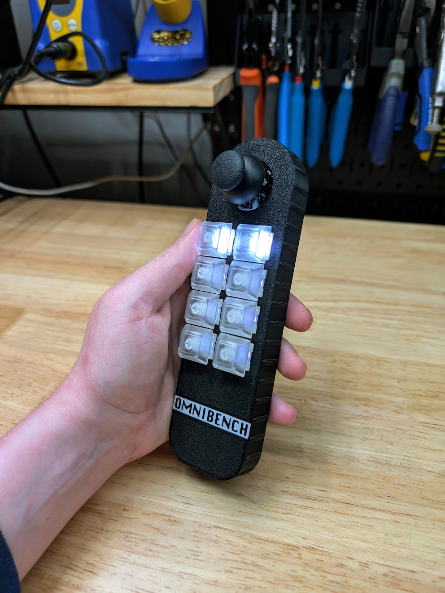
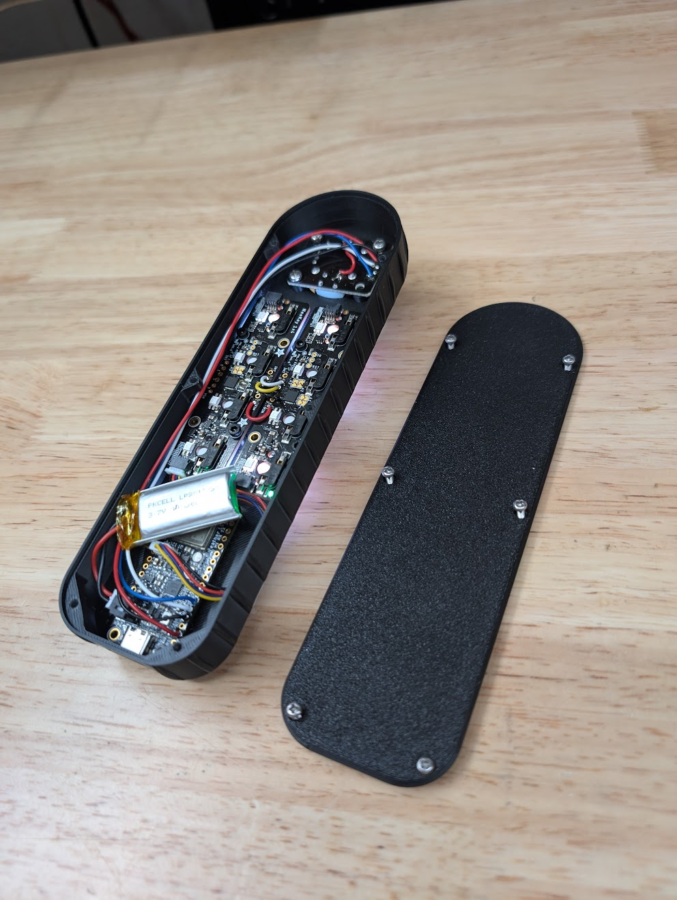
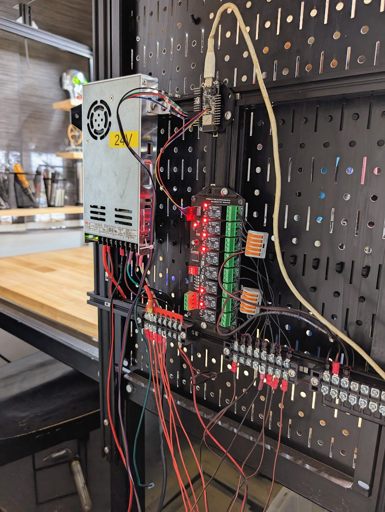

# omnibench

A Rust-based embedded control system for an ESP32-powered test bench with Bluetooth Low Energy (BLE) remote control. The project is split into two binaries: a **server** that runs on the test bench and controls hardware, and a **client** that runs on a handheld remote.

## Hardware

| Remote | Remote (internal) | Server |
|--------|-------------------|--------|
|  |  |  |

## Features

- **BLE Remote Control** — Custom GATT protocol connects server and client over Bluetooth LE. The client sends joystick and button events; the server pushes relay state back.
- **Relay Control** — Controls a 4-relay module over I2C (PCF8574a), with state synchronized to the remote in real time.
- **Stepper Motor** — Programmable stepper motor driver with smooth acceleration and deceleration ramping, driven via the ESP32 RMT peripheral. The joystick acts like a "sticky pedal": the server holds the last commanded speed even if joystick updates stop arriving momentarily, but automatically decays to zero if no input is received for 500 ms — acting as a fail-safe for BLE dropouts or a dropped remote.
- **Joystick Input** — Analog joystick on the remote with ADC smoothing, mapped to a signed byte (-127 to 127) for stepper speed control.
- **NeoKey Button Panel** — Adafruit NeoKey 1x4 RGB button matrix on the remote provides tactile input and color-coded connection status (white = connected, red = disconnected, blue = scanning).
- **Low-Power Remote** — Deep sleep with wake-on-interrupt keeps the handheld client power-efficient when idle.
- **Multi-Board Support** — Compile-time pin mappings and ADC calibration for both ESP32 and ESP32-S3 variants.

## Project Structure

```
src/
  bin/
    omniserver.rs   # Test bench controller (server binary)
    omniclient.rs   # Handheld remote (client binary)
  protocol.rs       # BLE message types (RelayState, ButtonEvent, JoystickEvent)
  server.rs         # GATT server: connection handling and notifications
  client.rs         # GATT client: scanning and connection management
  stepper.rs        # Stepper motor driver with ramping
  freq_gen.rs       # Pulse generation via ESP32 RMT
  board.rs          # Board-specific pin and ADC config
examples/           # Calibration and test utilities
```

## Tech Stack

- **Language**: Rust (2024 edition)
- **Target**: ESP32 / ESP32-S3
- **Key crates**: `esp-idf-svc`, `adafruit-seesaw`, `port-expander`, `embedded-hal`
- **Build**: Cargo + `embuild` for ESP-IDF integration
